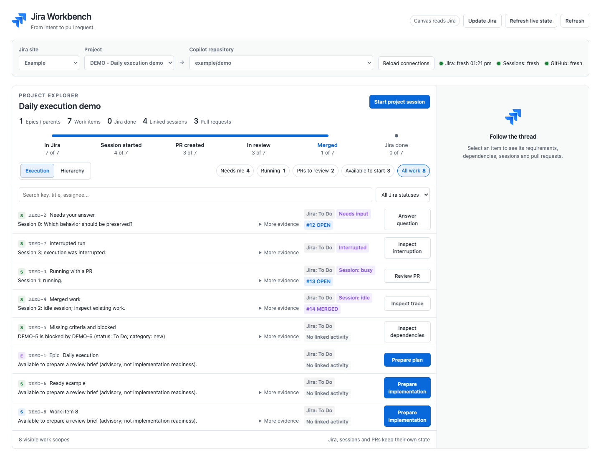
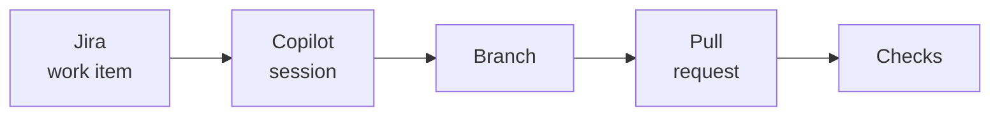
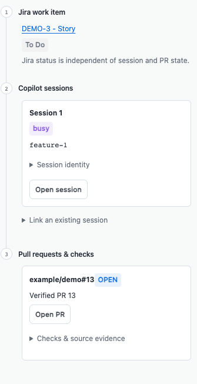

<div align="center">

# Jira Workbench

### From Jira intent to merged pull request - in one panel.

A GitHub Copilot app canvas that turns your Jira backlog into a work queue for
Copilot sessions, then traces each result back to the Jira issue it came from.

[](https://github.com/Sentry01/jira-workbench/actions/workflows/tests.yml) [](LICENSE)   

[Quickstart](#quickstart) · [Install](docs/install.md) · [Guide](docs/guide.md) · [Contributing](CONTRIBUTING.md) · [Security](SECURITY.md)

</div>



---

## Overview

This Copilot App canvas connects requirements in Jira, agents running in Copilot App sessions, and code landing in GitHub pull requests.
Without a link between them, you check all three by hand to answer two
questions: 

Jira Workbench helps you understand what needs your attention next and kick off agentic work in Copilot App from one panel. It works from observed evidence
(session state, pull request state, and checks) rather than from the Jira status
column.

## Features

| Feature | Description |
| --- | --- |
| **Execution queue** | Work is grouped into *Needs me*, *Running*, *PRs to review* and *Available to start*. An issue still in "To Do" with an active session appears under *Running*. |
| **Launch from an issue** | One click turns a Jira issue into an editable, hash-verified brief. Missing acceptance criteria and unresolved blockers are shown as warnings you must acknowledge before implementation starts. |
| **Traceability** | Each issue links to its sessions, branches, pull requests and checks, with the evidence for every link. Links are never inferred from similar titles or branch names. |
| **Hierarchy view** | Epics, stories and subtasks by Jira parent link. Missing parents stay visible, and parent cycles are reported. |
| **Read-only canvas** | The gateway allows only Jira reads. The canvas never edits, transitions or comments on issues, and never changes sprints. Status changes are delegated to sessions you launch: an issue session moves its issue to In Progress, and a confirmed **Update Jira** session corrects statuses across the project. |
| **No dependencies** | Plain JavaScript. It installs as a plugin or a folder copy and needs no build step. |

## Quickstart

You need an Atlassian connection in Copilot (the app's Atlassian Rovo connector
or an Atlassian MCP server) and a signed-in `gh` CLI. The
[install guide](docs/install.md) covers each prerequisite, how to check the
install, updating, uninstalling, and troubleshooting.

1. Install the plugin. This repository is its own plugin marketplace:

   ```sh
   copilot plugin marketplace add Sentry01/jira-workbench
   copilot plugin install jira-workbench@jira-workbench
   ```

2. Start a new Copilot session. A session loads plugins when it starts, so the
   session you installed from will not see the canvas.

3. In the new session, ask Copilot:

   > Open the jira-workbench canvas

4. Use the pickers along the top to choose your Jira site, a Jira project, and
   the Copilot repository to work in.

> [!IMPORTANT]
> The Jira project and the Copilot repository are chosen separately. A Jira
> project ID is not a Copilot project ID. The arrow between the pickers is the
> mapping you create, and it is saved, so you set it once per project.

When a new release is published, the panel shows **Update available**. One click
updates the plugin and restarts the panel on the new release.

For a full walkthrough with screenshots, see the [user guide](docs/guide.md).

<details>
<summary>Other ways to install</summary>

**From a git clone** (for contributors). The panel updates it with a fast-forward
pull:

```sh
git clone https://github.com/Sentry01/jira-workbench.git
ln -s "$PWD/jira-workbench/extensions/jira-workbench" ~/.copilot/extensions/jira-workbench
```

**As a one-off copy.** Ask Copilot to *install the canvas extension from
`https://github.com/Sentry01/jira-workbench/tree/main/extensions/jira-workbench`*.
The panel reports newer builds, but a copy can only be updated by installing it
again.

Keep only one install, because two register the `jira-workbench` canvas twice.
To move from a clone to the plugin without losing your saved data, see
[Switching from a git clone](docs/install.md#switching-from-a-git-clone-or-a-copied-install).
After a clone or copy install, ask Copilot to reload extensions.

To share your copy as a private gist, run `share_extension` (scope `user`, name
`jira-workbench`). The `artifacts/` folder is never shared.
</details>

## Tracing an item end to end



<table>
<tr>
<td width="360" valign="top">

</td>
<td valign="top">

Select any row, and the inspector shows the whole chain in three numbered steps:

1. **Jira work item** - the issue and its Jira status, shown independently of
   the steps below.
2. **Copilot sessions** - every session on the item, each with **Open session**.
   You can also link a session you started elsewhere.
3. **Pull requests & checks** - pull requests found in session metadata and
   verified on GitHub, with their reported checks.

Jira, sessions and GitHub each keep their own freshness timestamp, so a session
refresh never marks old pull request data as newly verified. Refresh the source
you doubt.

An idle agent, an open pull request and a missing check result are different
states. None of them means the work is done.

</td>
</tr>
</table>

## What it does not do

- **No Jira writes from the canvas.** The canvas never edits, transitions or comments on issues, never creates them, and never changes sprints. Status changes are delegated to sessions you launch. An issue session moves only its own issue to In Progress when it starts implementing (after plan approval in Plan mode). **Update Jira** starts one confirmed session that makes status-only fixes across the project and never reopens Done issues. These limits are set by the session's prompt and are not technically enforced; see [Security](SECURITY.md).
- **No fan-out.** One confirmed launch creates exactly one session.
- **No auto-merge or auto-approve.** Review actions open the real Copilot surface, and you decide.
- **No pending action shown as finished.** A pending request is labeled as pending. A launch with no session receipt after 15 minutes is marked as unknown, stops blocking new work, and can be cleared.
- **None of your private data in the source.** The source embeds no tokens, and none of your Jira domains, project IDs, repository names or user paths. Authentication stays with the Atlassian MCP connection and the GitHub CLI.

## Documentation

| Document | Contents |
| --- | --- |
| [Install](docs/install.md) | Prerequisites, Atlassian MCP setup, plugin install, checking the install, updating, switching from a clone, uninstalling, troubleshooting |
| [Guide](docs/guide.md) | Setup, the daily loop, launch briefs, traceability and troubleshooting, with screenshots |
| [Behavior reference](extensions/jira-workbench/README.md) | Execution semantics, freshness rules, the read-only boundary, known prototype limits |
| [Contributing](CONTRIBUTING.md) | Setup, the verification commands, and the rules reviewers check |
| [Security](SECURITY.md) | Private reporting, design boundaries, and where your local data lives |
| [Verification](verification/README.md) | The three browser harnesses, what CI runs, and the shared synthetic fixture |

## Requirements

- The Copilot app, with extension canvases and the SDK `tools.execute` API, plus the `copilot` CLI to install the plugin.
- An authenticated Atlassian connection: the Copilot app's Atlassian Rovo connector, or an Atlassian MCP server whose name contains `atlassian` or `jira`, or both. For an MCP server, the v2 endpoint (`https://mcp.atlassian.com/v2/mcp`) is recommended; v1 also works. Sign in with `/mcp auth atlassian`; the app signs in its connector.
- Your code repository added as a project in the Copilot app.
- The `gh` CLI, signed in, for GitHub.com pull request reads.
- Node.js 20 or newer, only to run the tests.

## Layout

```text
extensions/jira-workbench/   The installable canvas; this is what you share
  extension.mjs              Entry point; declares the canvas and its actions
  lib/                       Gateway, model, execution classifier, briefs, store, server, updater, plus:
    connection.mjs           The one supervisor of the Atlassian MCP connection
    workbench.mjs            Panel state; hands launches and traces to the two modules below
    launches.mjs             Launch briefs, requests, receipts, and their expiry
    trace.mjs                Session and pull request evidence for each work item
    view-model.mjs           The panel's pure display rules, unit-tested and served to the UI
    validate.mjs             Shared identifier rules (repository, session ID, issue key, ...)
    runtime.mjs              Shared, time-bounded helpers for Copilot runtime calls
  ui/                        Canvas renderer
  test/                      A node:test suite: no framework, no dependencies
docs/                        Install guide, user guide, screenshots, and their generator
verification/                Browser harnesses and the shared synthetic fixture
```

## Contributing

Issues, questions and first impressions are welcome, including "this confused
me". Start with [CONTRIBUTING.md](CONTRIBUTING.md). Everything runs with `node`,
and there is nothing to install:

```sh
node --test extensions/jira-workbench/test/*.test.mjs
```

By participating you agree to the [Code of Conduct](CODE_OF_CONDUCT.md).

## Local data

Repository mappings, UI preferences, trace links, reviewed briefs and launch
receipts are stored in
`$COPILOT_HOME/extensions/jira-workbench/artifacts/.local/state.json`. A
disposable warm-start cache of the Jira catalog and recently loaded hierarchies
sits next to it in `cache.json`, so a new session opens on your last project
straight away.

Both files describe your private work. They are git-ignored and excluded from
`share_extension`; never commit or publish them. Every screenshot in this
repository is generated from a synthetic demo fixture, not from real Jira,
session or repository data.

## License

[MIT](LICENSE) © Shlomi Shaki
