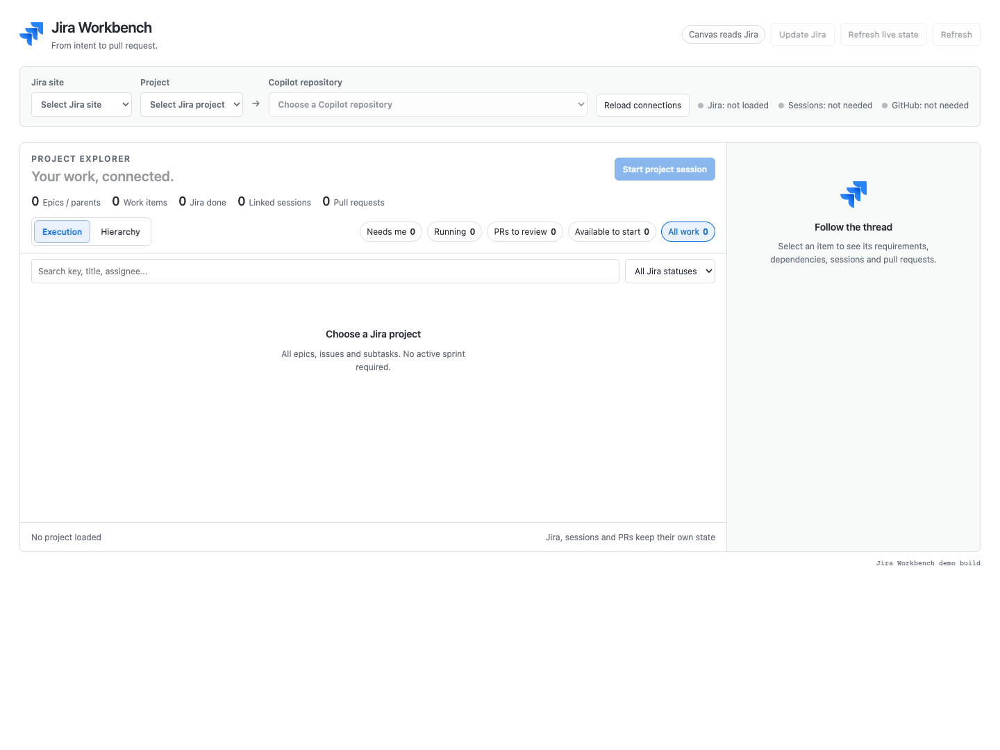
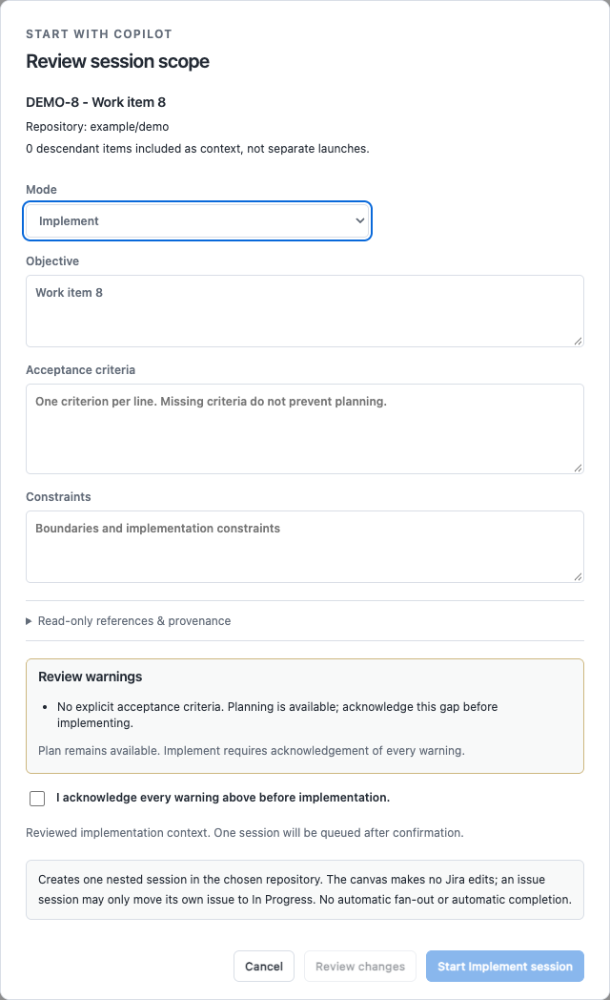
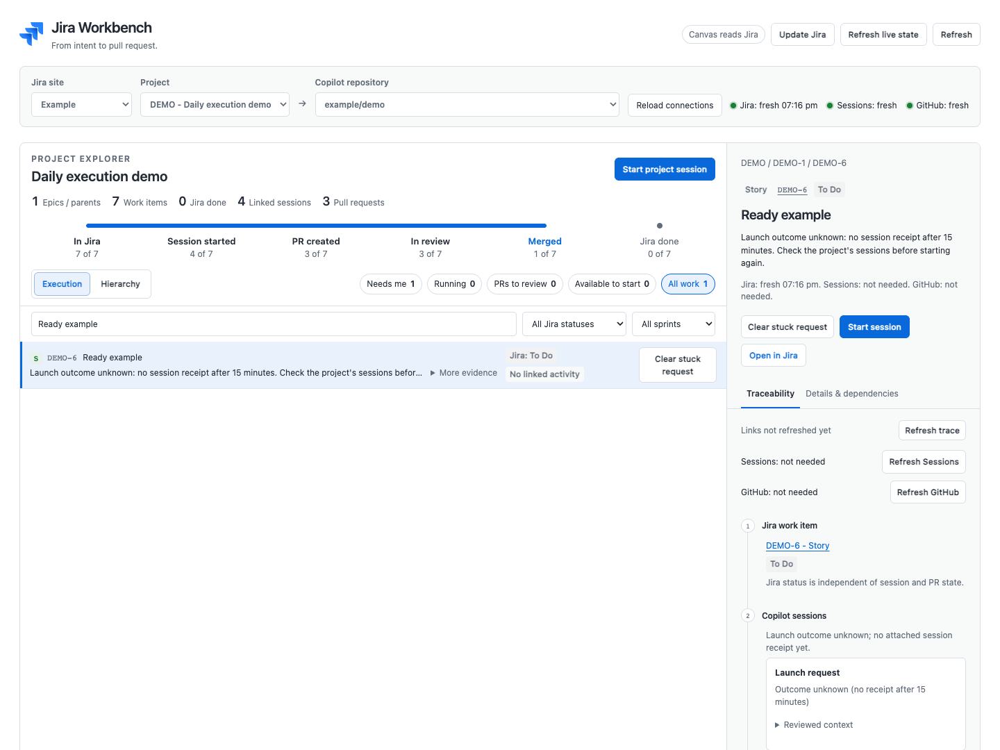
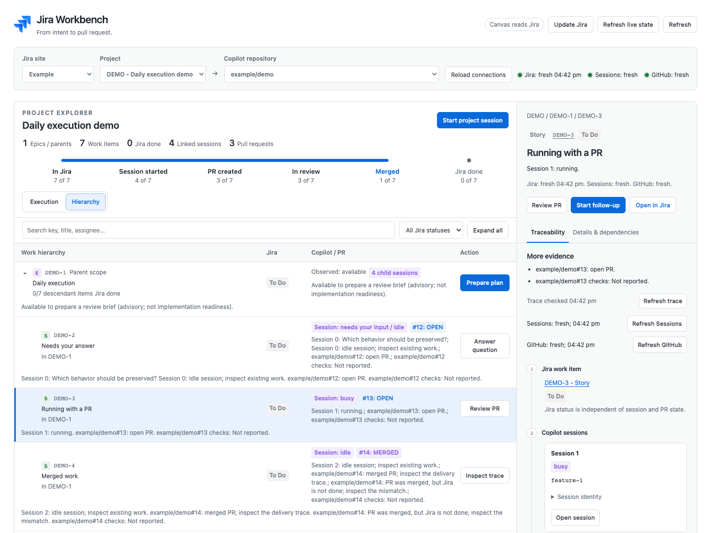
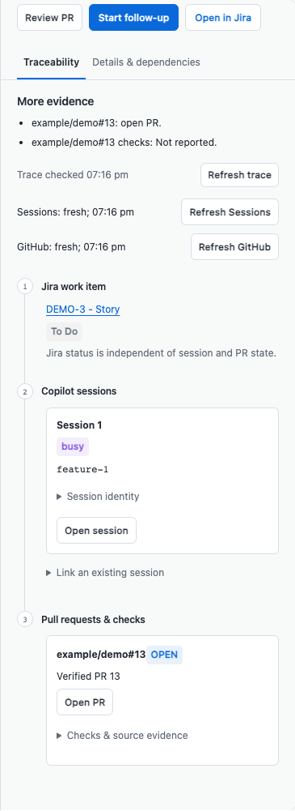
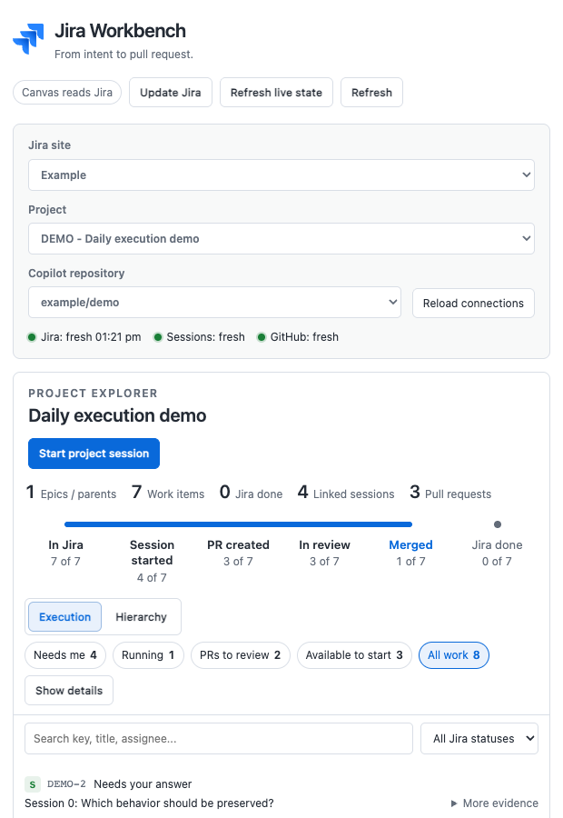

# Jira Workbench user guide

This guide is for engineers who run their work through the GitHub Copilot app.
It covers opening a Jira project in a side panel, starting a Copilot session
from a Jira issue, and following that issue to a merged pull request.

All screenshots come from a synthetic demo project, so the numbers in them are
examples, not your data.


---

## 1. Before you start

You need:

| Requirement | How to check |
| --- | --- |
| The Copilot app, with canvas extensions | You can ask Copilot to open a canvas |
| An authenticated Atlassian connection | The Atlassian Rovo connector is on in the Copilot app, or `/mcp auth atlassian` succeeds in Copilot. Not set up yet? See [Connect Atlassian to Copilot](install.md#1-connect-atlassian-to-copilot-once) |
| Your repository added as a Copilot project | The repository appears in your project list |
| The GitHub CLI, signed in | `gh auth status` |
| Node.js 20 or newer (only to run the tests) | `node --version` |

The canvas only reads Jira. It never edits an issue, changes a status, adds a
comment, or changes a sprint. When you launch work on an issue, the new Copilot
session is told to move only that issue to an In Progress status once it starts
implementing: immediately in Autopilot, or after you approve the plan in Plan
mode. Project-level launches make no Jira changes. Refresh Jira in the canvas to
see the new status.

**Update Jira** (top right) is the only project-wide write, and it runs only
after you confirm. It starts one Copilot session that checks every issue in the
project against its linked sessions, pull requests, branches and commits, then
moves any issue whose status is wrong. It changes only statuses, never reopens
Done issues, and ends with a summary table. See
[Keep Jira statuses accurate](#keep-jira-statuses-accurate).

Both limits are instructions in the launched session's prompt, not technical
controls; the session uses your own Atlassian access. See
[SECURITY.md](../SECURITY.md).

---

## 2. Install the canvas

Install it as a Copilot plugin. The repository is its own marketplace:

```sh
copilot plugin marketplace add Sentry01/jira-workbench
copilot plugin install jira-workbench@jira-workbench
```

Then start a new Copilot session. A session loads plugins when it starts, so the
session you installed from will not see the canvas, even after reloading
extensions.

The [install guide](install.md) covers repository access, adding the Atlassian
MCP server, checking the install, updating, switching from a git clone,
uninstalling, and install problems. To install from a git clone or as a copy,
see the [README](../README.md).

### Staying up to date

While a Workbench panel is open, the canvas checks for a new release shortly
after the panel opens and every ten minutes after that. With no panel open, it
checks nothing. The plugin installs releases, not the latest `main`, so a merged
change reaches you when the next release includes it. When the check finds a
newer build, a banner appears above the work queue:

- **Update available ... Update & reload** updates the install and restarts the
  Workbench. The open panel comes back on the new build by itself.
- **A different build is on disk ... Reload** means the files were already
  updated (for example by `git pull` or another session). Reloading runs them.
- **... has local changes** means a git checkout has uncommitted edits. The
  Workbench never updates it for you; commit or stash the edits, then pull.

The small label under the panel names the running build. A git clone shows its
own commit and date. A plugin install shows the version, commit and date of the
release it matches, such as `v1.1.0 · 1a2b3c4 · 2026-10-03`, and
`v1.1.0 · tree <hash>` when it matches no release.

---

## 3. Open it and connect three things

Ask Copilot:

> Open the jira-workbench canvas

The panel opens empty, with three pickers along the top.



Fill them in from left to right:

1. **Jira site**: your Atlassian site.
2. **Project**: any Jira project you can browse. No active sprint is required;
   the canvas shows all of the project's work.
3. **Copilot repository**: the repository Copilot should work in.

> [!IMPORTANT]
> The Jira project and the Copilot repository are chosen separately. A Jira
> project ID is not a Copilot project ID. The arrow between the pickers is the
> mapping you create.

The mapping is saved per project, so you set it once.

---

## 4. The daily loop

Most of your time is spent in the **Execution** view. It shows what to pick up
next.


The filters across the top group the work:

| Filter | Contents |
| --- | --- |
| **Needs me** | A session asked a question, a plan is waiting, something failed, or a launch never reported its session |
| **Running** | A session is working, or a launch is waiting for its session (for up to 15 minutes) |
| **PRs to review** | A verified open pull request that is not a draft |
| **Available to start** | Nothing observed blocks a brief. This is advisory, not a readiness score |
| **All work** | Everything, including finished work |

Each row has one main action, such as *Answer question*, *Review PR*,
*Inspect trace* or *Prepare implementation*. These open the real Copilot
surface rather than a copy of it. *Review PR* opens the session that created the
pull request, in its own repository, where the app shows the built-in PR tab;
the Workbench stays open in its own session. A pull request with no linked
session opens in the app's native PR view.

Keep two points in mind:

- The groups come from observed evidence (session state, pull request state and
  Jira), not from the Jira status column. An issue in "To Do" with a busy
  session appears under *Running*.
- If a row is in an unexpected group, expand **More evidence** to see why.

---

## 5. Start work from a Jira issue

Click **Prepare plan** or **Prepare implementation**. You get an editable brief
before anything is created.



The brief is the spec the agent will work from:

- **Objective** and **acceptance criteria** are filled in from explicit sections
  of the Jira issue. Plain description text is not turned into a checklist. If
  criteria are missing, the brief says so.
- **Warnings** (missing criteria, unresolved dependencies, unavailable parent
  requirements) are always shown. You can still plan, but to implement you must
  tick the acknowledgement.
- You can edit any field. Editing clears an earlier acknowledgement, so you
  cannot approve one brief and then start a different one.

Nothing is queued until you press **Start Plan session** or
**Start Implement session**.

Default modes:

| Scope | Default mode | Reason |
| --- | --- | --- |
| Project, epic or other parent | **Plan** | Break the work down before building it |
| A single work item | **Implement** | It is already the smallest unit |

Every Start button uses these defaults: a queue row's prepare action, the
inspector's **Start session** and **Start follow-up**, and
**Start project session**. You can change the mode in the brief before you
start.

Each launch creates exactly one session, nested under the canvas session. Child
issues never get sessions automatically.

### When a launch never reports back

After you press Start, the item shows **Launch queued** until the new session
reports back. While a launch is queued, you cannot start a second one on the same
item, so work is never duplicated.

If nothing reports back within 15 minutes (for example, the agent's turn was
dropped or the panel was closed), the item moves to **Needs me** and shows
**Launch outcome unknown**:



- It no longer blocks **Start** or **Update Jira**.
- **Check the project's sessions before starting again.** The launch may have
  created a session that never reported back.
- To remove it, press **Clear stuck request**, then **Confirm clear** within a
  few seconds. The first click alone does nothing.
- If the session reports back later, even after you cleared the request, it is
  still linked to the item.

---

## 6. See the whole structure

Switch to **Hierarchy** to see epics, stories and subtasks by Jira parent link.



- Search (by key, title, assignee or parent key) and the status filter apply to
  both views. Searching for a parent's key also finds its children.
- The status filter lists the selected project's own workflow statuses, grouped
  by category, so custom steps such as "PR Waiting" can be filtered on even
  before any issue is in them. Pick a category to match all of its statuses.
- A missing parent stays visible with a warning, and a parent cycle is reported
  rather than dropped.
- Parent progress counts descendant work items, not story points.
- Your selection, filters, expanded rows and scroll position are saved per
  project.

---

## 7. Follow one item end to end

Select any row and open the **Traceability** tab. It shows the chain from the
Jira work item to the checks.



The three steps are always in the same order:

1. **Jira work item**: the issue and its status. Requirements live here, whether
   the project started in Jira or was created from a PRD.
2. **Copilot sessions**: every session on the item, each with **Open session**.
   You can also link a session you started elsewhere by its app session ID.
3. **Pull requests & checks**: pull requests found in session metadata and
   verified on GitHub, with their checks.

Links are never inferred from similar titles or branch names.

### Refresh the right source

Jira and GitHub data are snapshots, not live feeds, so each source has its own
refresh button:

| Button | Re-reads |
| --- | --- |
| **Refresh** (top right) | Jira, then sessions and GitHub for the project |
| **Refresh live state** (top right) | Sessions and GitHub for the project |
| **Refresh trace** (inspector) | Sessions and pull requests for this item |
| **Refresh Sessions** / **Refresh GitHub** (inspector) | That one source, for the project's linked work |
| **Refresh Jira** (on a queue row) | Jira only |

Each source has its own timestamp, so a session refresh never marks old GitHub
data as newly verified.

The connection bar shows a dot for each source:

- **Green**: read in this session.
- **Orange**: cached or partly stale.
- **Red**: the last read failed, or the source is unavailable.
- **Grey**: not loaded or not needed.

Hover over, tap, or tab to a dot for details.

### Keep Jira statuses accurate

When Jira no longer matches the work (for example, a pull request merged but the
issue still says To Do), click **Update Jira** in the header and confirm.

It starts one Copilot session in the mapped repository. That session:

1. Lists every issue in the project.
2. Checks each issue against its linked sessions and pull requests, plus GitHub
   pull requests, branches and commits that mention the issue key.
3. Moves an issue to **In Progress** when work is active or a pull request is
   open, and to **Done** when merged work clearly delivers it and nothing for it
   remains open. It uses the project's own workflow: if the project has a review
   or waiting step (for example "PR Waiting"), an issue whose work is in an open,
   non-draft pull request goes there instead of In Progress. Anything unclear is
   left alone and reported.
4. Ends with a summary table: issue, old status, new status, and evidence.

The session changes only statuses. It makes no field edits, comments,
assignments or sprint changes, and never reopens Done issues. It decides what to
change, so read its summary.

The button is disabled until Jira data is fresh, a repository is mapped, and no
other project launch is queued (a launch with no receipt after 15 minutes does
not count). Click **Refresh** afterwards to see the new statuses.

---

## 8. Narrow panels

In a narrow panel, the canvas shows a single column. **Show details** opens the
inspector, and **Back to work** returns to the list. The tree supports keyboard
navigation.



---

## 9. Recommended practices

1. **Treat the brief as the spec.** Fixing the acceptance criteria in the brief
   saves a review cycle later.
2. **Plan parents, implement leaves.** Ask an agent to break down an epic, and to
   build a story.
3. **Use one session per work item.** This keeps the trace readable and isolates
   failures.
4. **Read warnings before acknowledging them.** A missing-criteria warning means
   the issue is not ready.
5. **Idle does not mean done.** An idle agent, an open pull request and a missing
   check result are different states, and none of them means finished. Check
   the trace.
6. **Refresh only the source you doubt.** If a pull request looks out of date,
   refresh GitHub, not everything.

---

## 10. When something looks wrong

Start with the Atlassian connection. The canvas keeps one connection for all its
panels, and it is always in one of four states:

| State | What you see | What to do |
| --- | --- | --- |
| **Connecting** | "Connecting to Jira and Copilot...", "Loading ... from Jira...", or your last project with "Showing the cached ... snapshot while Jira and Copilot reconnect..." | Nothing. The canvas confirms the server with one Jira read, then loads your project |
| **Ready** | A green Jira dot and no banner | Nothing. While a panel is open, a light read every 4 minutes keeps your sign-in fresh |
| **Sign-in needed** | **Atlassian needs you to sign in**, with **Sign in to Atlassian** | Sign in. Until you do, the canvas keeps the last good data and sends no Jira requests from the panel unless you press **Refresh**. It checks for your sign-in at most once per interval, starting at 5 seconds and slowing to 5 minutes, and reloads by itself when you finish |
| **Down** | The server and its state, such as "MCP server atlassian is stopped", and "Reconnecting automatically in about Ns" | Usually nothing. The canvas keeps the last good data, retries, and restarts a failed server up to 3 times. A stopped or disabled server needs `/mcp` |

Then find the message you see:

| Message or symptom | Fix |
| --- | --- |
| "Atlassian needs you to sign in", "... sign-in has expired", or "... needs sign-in" | Press **Sign in to Atlassian** in the canvas, or run `/mcp auth atlassian`. If the canvas asks you to reconnect the Atlassian connector instead, reconnect it in the Copilot app. The canvas reloads your site and project when you finish |
| "Copilot did not answer ... Retrying automatically" | Wait: the last good data stays visible and the canvas retries. If it persists, reload extensions. If that does not help, restart the Copilot session |
| "MCP server atlassian is stopped" | Start it with `/mcp` in Copilot. The canvas loads within about a second |
| "atlassian failed to connect" | Usually nothing: the canvas restarts the server itself, up to 3 times. If it keeps failing, restart it with `/mcp` |
| "Reconnecting automatically in about Ns" | Nothing. The canvas retries by itself; you never need **Reload connections** |
| "...while MCP servers finish connecting" | Nothing. The canvas retries while the server starts |
| No Jira sites or projects listed | Check the connection state above. The canvas lists only projects you can browse |
| No repositories in the third picker | Add the repository as a project in the Copilot app |
| A pull request is missing from the trace | Press **Refresh GitHub**. Pull requests come from session metadata and must be verified on GitHub |
| Counts look out of date | Jira data is a snapshot. Press **Refresh** |
| The canvas does not appear | Start a new Copilot session, because plugins load when a session starts. If it is still missing, see [install troubleshooting](install.md#troubleshooting) |
| "A different build (...) is on disk. Reload to run it." | Press **Reload** in the banner, or ask Copilot to reload extensions. The session started before the files were last updated |
| "Launch outcome unknown: no session receipt after 15 minutes" | Check the project's sessions first, because the launch may have created one. Then start again, or press **Clear stuck request** and **Confirm clear**. See [When a launch never reports back](#when-a-launch-never-reports-back) |
| "Copilot did not answer the navigation request within 30s. Try again." | Press the button again to start a new request. If it keeps happening, reload extensions |

---

## 11. What it does not do

- **No Jira writes from the canvas.** The canvas never edits, transitions or comments on issues, never creates them, and never changes sprints. Status changes are delegated to sessions you launch: an issue session moves only its own issue to In Progress, and a confirmed **Update Jira** session may change statuses across the project.
- **No fan-out.** One confirmed launch creates one session.
- **No auto-merge or auto-approve.** Review actions open the real Copilot surface, and you decide.
- **No pending action shown as finished.** A pending navigation is labeled as
  pending, and a launch with no receipt after 15 minutes is marked as unknown.

---

## Where your data lives

Repository mappings, UI preferences, trace links, reviewed briefs and launch
receipts are stored in:

```text
$COPILOT_HOME/extensions/jira-workbench/artifacts/.local/state.json
```

To keep `state.json` small, only the 20 most recent finished launch requests per
work item (or project) are kept. Launches still waiting for a receipt are always
kept.

A warm-start cache of your Jira catalog and recently loaded hierarchies sits next
to it in `cache.json`, so each new session opens on your last project straight
away and refreshes in the background. You can delete it at any time; it is
rebuilt on the next load.

Both files describe your private work. They are git-ignored and excluded from
`share_extension`; never commit or publish them.

---

## Further reading

- [`extensions/jira-workbench/README.md`](../extensions/jira-workbench/README.md):
  the full reference, covering execution semantics, freshness rules, the
  read-only boundary, and known prototype limits.
- [`verification/README.md`](../verification/README.md): the browser harnesses.
- To regenerate these screenshots after a UI change:

  ```sh
  WORKBENCH_ROOT="$PWD/extensions/jira-workbench" node docs/screenshots.mjs
  ```
