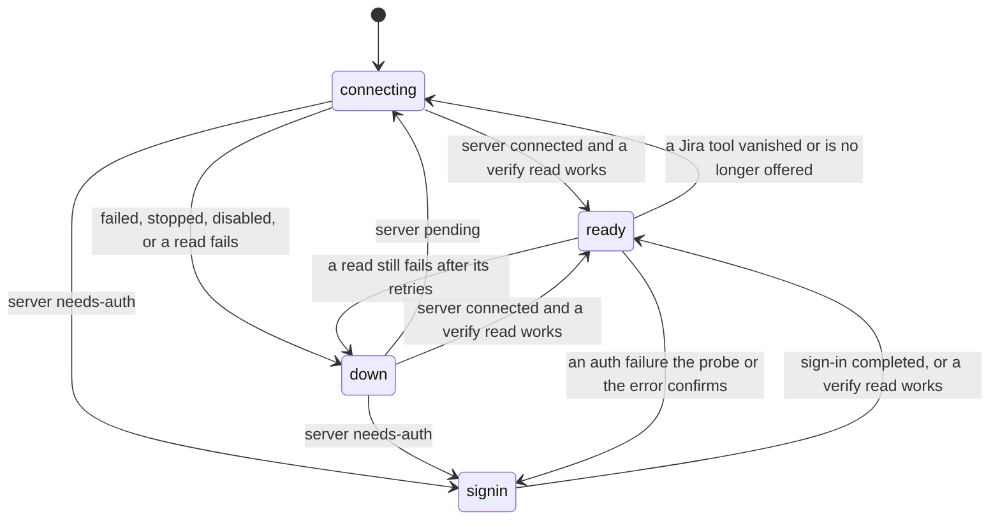

# Jira Workbench

A personal Copilot app canvas for browsing Jira hierarchy and following work from
requirements to a Copilot session, branch, pull request, and reported checks.
It ships as a Copilot plugin from this repository's own marketplace, and the canvas
itself only reads Jira.

## Requirements

- The Copilot app with extension canvases and the SDK `tools.execute` API.
- An authenticated Atlassian MCP connection exposing Jira site discovery,
  browseable projects, and JQL search: the Copilot app's Atlassian Rovo
  connector, an Atlassian MCP server, or both. Both the Rovo MCP v1 endpoint and
  the recommended v2 endpoint (`https://mcp.atlassian.com/v2/mcp`) work; on v2
  the project list and each project's workflow statuses are read through
  `executeRead` (`listJiraProjects` and `listJiraStatuses` only). When
  several Atlassian servers offer the same tools, the Workbench reads from the
  most usable one and prefers the app's connector when both are connected.
- GitHub repository projects already configured in the Copilot app.
- An authenticated `gh` CLI for GitHub.com pull request reads.
- Node.js 20 or newer for the dependency-free unit tests.

The extension source embeds no API tokens, and none of your Jira domains, project
identifiers, repository names or user paths. Authentication remains with
Atlassian MCP and the GitHub CLI.

## Open and use

For a screenshot-led walkthrough of install, setup, and the daily loop, see
[`docs/guide.md`](../../docs/guide.md) in the repository. The steps below are the
condensed version.

1. Install it: `copilot plugin marketplace add Sentry01/jira-workbench`, then
   `copilot plugin install jira-workbench@jira-workbench`, then start a new
   Copilot session (a session loads plugins when it starts). The full install
   guide, with prerequisites, is [`docs/install.md`](../../docs/install.md).
   A git clone linked into `~/.copilot/extensions/jira-workbench/`, or an
   `install_extension` copy of this folder, also works; see the repository README.
2. Ask Copilot to open the `jira-workbench` canvas with an empty input object.
3. Pick a Jira site and project, then select its Copilot repository independently.
   A Jira project ID is **not** a Copilot project ID.
4. Use **Execution** for the next useful action, or **Hierarchy** for project
   structure. All project work is included, whether or not it is in a sprint.
5. Select an item to inspect requirements, dependencies, and trace links.
   Select the project title to inspect project-level coordination sessions.
6. Use a preparation action to review scope, repository, objective, acceptance
   criteria, and constraints. Only the final **Start Plan/Implement session**
   confirmation queues work.

Every Start button opens the brief in the same default mode: **Plan** for the
project and parent issues, and **Implement** (Autopilot) for leaf work items. That
covers a queue row's prepare action, the inspector's **Start session** and
**Start follow-up**, and **Start project session**. You can change the mode in the
brief. Every launch requests exactly one session, nested under the canvas-owning
session; there is no automatic child fan-out.

Existing sessions can be opened, explicitly linked by app session ID, or followed
by a new session. Linking checks the session's Copilot project before saving it.

### Build label and updates

The small label under the panel names the build this process loaded, read once at
load. A git checkout shows its commit and date (`-dirty` with local changes). A
plugin or copied install has no `.git`, so it is identified by git's tree hash of
this folder, which equals the folder's SHA on GitHub. When its tree matches the
build an update would install, it shows that build's commit and date, prefixed
with the release version for a pinned release (`v1.1.0 · 1a2b3c4 · 2026-10-03`);
otherwise it shows `v<version> · tree <hash>`. A checkout nested inside another
repository (such as a versioned `~/.copilot`) is never mistaken for this one.

Plugin installs follow releases. The marketplace entry in
`.github/plugin/marketplace.json` on the default branch pins the release that
`copilot plugin update` installs (`"ref": "v<version>"`), so the check reads that
pin and compares with the release's folder, not with the tip of `main`. A pin
whose tag does not exist yet (a release merged moments ago) is treated as a failed
check, never as an update. Without a pin (a path source such as `"./"`), the
default branch is the build an update installs, and the check compares with it.

The upstream check runs only while a Workbench panel is open. Fifteen seconds after
the first panel opens, and every ten minutes after that, the extension compares the
loaded identity with upstream, and the panel shows a banner when it differs. The
checks stop when the last panel closes, so a session that has the extension
installed but no panel open never runs `git` or `gh`. What it compares and what
**Update & reload** does depend on the install:

| Install | Compared with | Update & reload does |
| --- | --- | --- |
| Git checkout on a tracking branch | the branch's upstream, after `git fetch` | `git merge --ff-only @{u}`, then reloads the session's extensions |
| Plugin | the extension folder of the release pinned in the default branch's marketplace manifest, or of the default branch when unpinned (`gh api graphql`) | `plugins.update` for `jira-workbench`, then reloads plugins and extensions |
| Copy | as for a plugin | nothing: reinstall to update |

A checkout with local changes, a branch that has diverged from its upstream, or a
detached HEAD is never updated.

Each Copilot session keeps its own extension process for its whole lifetime, so a
session opened before a `git pull` or `copilot plugin update` keeps running the
older build. The panel's HTML, script, and styles are loaded with the server code,
so an old process always serves a matching old UI instead of new UI against an old
API (which showed an empty panel with no site or project). Each panel also asks
about once a minute; a cheap local check (`git rev-parse HEAD`, or the folder's tree
hash) notices when the files on disk differ from the loaded build, and the banner
then offers **Reload** only. A reload restarts every extension in the
session; the host re-opens open panels against the new process. Background checks
that fail (offline, `gh` signed out) stay silent; pressing the button reports why.

## Daily execution

The queue is derived from recorded Jira, Copilot, and GitHub evidence:

- **Needs me:** pending questions, plans awaiting review, observed failures,
  review actions, sources that need refreshing, or a launch request whose outcome
  is unknown (see [Launch requests that never report back](#launch-requests-that-never-report-back)).
- **Running:** active sessions, or launch requests still waiting for their session
  receipt (for up to 15 minutes).
- **PRs to review:** verified open, non-draft PRs, excluding stale, merged,
  closed, and draft PRs.
- **Available to start:** no observed existing work or known blocker prevents
  preparing a brief. This is advisory, not a readiness score.
- **All work:** includes historical delivery and all secondary signals.

Views overlap: running work can also have an open PR. Counts describe work scopes,
not completed work. Project coordination appears in the queue only when the
project itself has a linked session or launch; child signals are not duplicated
into manufactured project actions.

The **progress tracker** under the project metrics rolls work items up across six
stages, in order: **In Jira**, **Session started**, **PR created**, **In review**,
**Merged** and **Jira done**.
Each stage counts work items with that stage's own evidence (a launch or linked
session, any linked PR, a ready-for-review or merged PR, a merged PR, Jira's done
category), so a later stage never implies an earlier one. The bar runs to the
furthest stage any item has reached. Stages whose source is stale or unavailable
are dimmed as unverified until refreshed.

**Review PR** (and every other PR action) opens the Copilot session that created the
pull request. That session lives in the PR's own repository, so the app shows its
built-in PR tab there (description, files, reviews, checks, commits). An extension can't
add a built-in PR tab to another repository's session, so a PR from another repository
can't open next to the Workbench. If no linked session owns the PR, the app's native PR
view opens instead.
**Answer question** and **Review plan** open the native session. Navigation prefers offered native host tools; when unavailable,
an explicit agent-mediated fallback remains queued until its acknowledgement.
The UI never presents a queued request as a completed navigation and does not
start a new session to satisfy Open.

Native navigation is time-bounded: reading the host's tool list gets 8 seconds, and
the navigation call itself gets 30 seconds. On a timeout the navigation is recorded
as failed ("Copilot did not answer the navigation request within 30s. Try again.")
and the item is released, so pressing the button again starts a fresh request. A
runtime that answers late cannot rewrite the recorded outcome.

The launch brief is editable. Explicit acceptance sections can prefill criteria;
general description prose does not invent a checklist. Missing criteria, unavailable
parent requirements, and recorded unresolved dependencies are visible warnings.
Planning stays available; implementation requires acknowledging warnings in the
same preview. Editing fields or changing source context invalidates acknowledgement.
The server enforces the reviewed hash and warning set, not just the form.

Each launch stores a private immutable brief, its content hash, source provenance,
and acknowledgements with the request and resulting session. A lost HTTP response
can be reconciled by the persisted preview/request identity rather than retrying
creation blindly.

The status filter is built per project: each status category, then that
project's own workflow statuses (for example a custom "PR Waiting" step), read
with `listJiraStatuses` after each Jira refresh and merged with the statuses seen
on loaded issues. A step no issue is in yet still appears. On Atlassian MCP v1,
which has no status listing, or when the listing fails, the filter offers the
statuses seen on issues and the Jira refresh is unaffected.

The sprint filter lists the sprints the loaded issues belong to, plus **No
sprint** when some work has none. Sprint field IDs differ per Jira site, so the
gateway finds the field once per site: it reads one issue matching
`sprint is not EMPTY` and keeps the custom field whose value holds sprints.
Projects without sprints, and sites without Jira Software, show no sprint filter.
A saved sprint the project no longer offers is treated as "all" until it returns.

Project-scoped selection, view, filters, expansion, and scroll are remembered.
Narrow panels use a focused detail view with **Back to work**. Pending actions do
not disable unrelated navigation or search.

### Launch requests that never report back

A confirmed launch, or an **Update Jira** sync, is stored as a queued request until
the canvas-owning agent records the session it created (`record_session`) or the
failure (`fail_request`). While it is queued it blocks a second launch for the same
issue or project, so duplicate work is never started.

If no receipt arrives within **15 minutes** (a dropped agent turn, a closed panel),
the request becomes **Launch outcome unknown**. Expiry is worked out each time the
state is read, so it needs no timer and no write. An expired request:

- moves from **Running** to **Needs me**;
- no longer blocks **Start**, the launch badge, or **Update Jira**;
- offers **Clear stuck request**, in the queue row and in the inspector.

The launch may still have created a session that never reported back, so **check
the project's sessions before starting again**. Clearing takes two clicks:
**Clear stuck request** arms **Confirm clear** for 8 seconds, and only the second
click sends the request to `/api/clear-request`. The request is then marked
cleared, and the trace's **Launch request** card says "Cleared". Clearing only
marks the request: a receipt that arrives late, even after a clear, still attaches
the real session.

## Hierarchy and traceability

- Jira parent links define hierarchy; boards and sprints are not parent levels.
- Missing parents remain visible with a warning. Cycles are surfaced, not hidden.
- Parent completion counts are labeled as descendant work items, not story points.
- Direct coordination sessions are distinguished from sessions on child issues.
- Multiple sessions and historical PR links are retained.
- The trace runs from the Jira work item to Copilot sessions to PRs. Requirements live in
  Jira; GitHub issues referenced from Jira are not traced.
- PRs are discovered from recorded app session metadata and verified on GitHub.
  They are not inferred by similar titles or branch names. A session counts as PR
  evidence only when the host reports both `created_pr_number` and
  `created_pr_repo`; a PR's repository is never inferred from the session's own
  project.
- Jira status, session activity, PR state, and checks remain separate.
  An idle agent, open PR, or missing check result is **not** completion.

The header's **Refresh** re-reads Jira, then the project's linked sessions and
GitHub evidence. **Refresh live state** re-reads only the linked sessions and
GitHub evidence. In the inspector, **Refresh trace** re-reads one item's sessions
and PRs, and **Refresh Sessions** or **Refresh GitHub** re-reads that one source
for the project's linked work. A queue row whose evidence is stale offers the
matching refresh: **Refresh Jira** (Jira only), **Refresh live state**, or
**Refresh trace**. The visible panel refreshes session observations and polls local
receipts, pausing during context preparation. Jira and GitHub are not continuously
polled: their displayed observations remain snapshots until refreshed.

### Opening in a new session

Every Copilot session runs its own extension process, so the panel cannot share
memory between sessions. Instead it opens on the last selected project from
`cache.json` immediately, labelled **Jira: cached · refreshing**, while it
reconnects in the background: it waits for Atlassian MCP tools that are still
registering, re-checks site and project access, reloads Jira, then refreshes
linked session and GitHub evidence. Cached data is view-only: preparing or
launching work requires the Jira hierarchy to be re-verified in this session
first. A project that is no longer browseable is dropped from the view.

### Keeping the Atlassian MCP connection alive

`lib/connection.mjs` is the one place that decides whether Jira is reachable. There
is one `Connection` per extension process, shared by every open panel: a single
state machine driven by a single timer. Underneath it, `lib/gateway.mjs` is
stateless. It makes allowlisted reads and returns every failure classified as
`auth`, `transient`, `gone`, `unavailable` or `permanent`, and the supervisor
decides what that means for the connection.



| State | Meaning | What the Workbench does |
| --- | --- | --- |
| `connecting` | The Jira MCP server is starting, or a Jira tool vanished and the server list must be re-checked | Polls `mcp.list` and confirms a connected server with one real Jira read; if that read fails, the next one waits 2s, doubling to 60s |
| `ready` | A Jira read worked | No polling. While a panel is open, one keepalive read every 4 minutes, so the runtime refreshes an expiring OAuth token before you hit it |
| `signin` | The Atlassian sign-in expired, or the server reports `needs-auth` | Panel reads fail fast without reaching the runtime, and the panel shows **Sign in to Atlassian**. A probe answer of 401 or `needs-auth` makes no read at all. An unclear answer, such as Atlassian v2's 400, allows **at most one single-attempt verify read per backoff step** (5s, doubling to 5 minutes). Finishing sign-in (`mcp.oauth_completed`), an `authenticated` probe, or the server going from `needs-auth` to `connected` verifies at once. An explicit **Refresh** makes exactly one attempt |
| `down` | The server failed, is stopped or disabled, none is configured, or reads keep failing | Keeps the last good data and keeps polling. A `failed` server is restarted at most 3 times, after 2s, 15s and 60s, and that budget is restored only after a Jira read works. `stopped` and `disabled` servers are left to you |

While Jira is not `ready`, the supervisor polls `mcp.list` (about 4ms, no Jira
call) every second for 30 seconds after any change, then every 2s, doubling to 60s.
An MCP event, a panel attaching, a failed read, or **Sign in** schedules a check
after a 500ms debounce, so a burst of triggers costs one check. With no panel open
there is no polling and no keepalive.

Each state change and each MCP event is passed to every panel. A panel that needs
it runs one recovery pass (at most one running and one queued) that reloads the
site and project you last picked, so **Reload connections** is never required.
Errors name the Jira server and its state, never an unrelated server that needs
sign-in. A missing Copilot host tool is reported as Copilot's ("Copilot did not
offer ...; update or restart Copilot."), not blamed on Jira. Identical reads in
flight, or answered in the last 1.5s, are shared, so several open panels cost what
one does.

The design follows from these runtime behaviors, each observed live:

| Runtime behavior (observed live) | How the Workbench handles it |
| --- | --- |
| `tools.getCurrentMetadata()` is a snapshot built before MCP servers finish connecting; only `tools.initializeAndValidate()` (about 2s) rebuilds it | The gateway rebuilds when a Jira tool is missing, shared by concurrent callers and at most once per 4s unless an MCP event invalidates it |
| MCP status events reach extensions late and in batches (12s+) | The supervisor polls `mcp.list` while Jira is not `ready` instead of waiting for events |
| An expiring OAuth token fails one call while the runtime refreshes it silently, with no event | The gateway retries an auth, rate-limit or network failure twice (after 1.5s, then 3s), and the keepalive read refreshes the token early |
| An **expired Atlassian sign-in** keeps `mcp.list` at `connected`, fails every call with "Re-authentication required", and makes the runtime broadcast an unanswered OAuth request per failed read (1,775 in one day) | The `signin` state stops panel reads and limits verify reads to one per backoff step. At the 5-minute cap that is about 290 sign-in-triggering reads a day, instead of about 34,000 with the earlier 3-second watch against Atlassian v2 |
| The passive `mcp.oauth.probe` answers 401 for an expired v1 sign-in, but Atlassian v2 answers 400 whether or not the token works | Only 401 (or `needs-auth`) counts as "expired"; any other answer is "unknown", which still allows only one verify read per step |
| With a dead cached token, `mcp.oauth.login` on v2 throws "probe returned HTTP 400" | **Sign in to Atlassian** retries once with `forceReauth`, and also forces re-auth when the runtime returns no URL but the probe says expired |
| A server can drop to **`needs-auth`**: its tools vanish, and a tool still in the snapshot fails with "Tool '...' does not exist" | Treated as `signin` straight from the server status, with no probe. The panel keeps the last good data and reloads as soon as the server is `connected` again |
| A Jira server can end up `failed` | Restarted on the budget above |
| `tools.getCurrentMetadata()` and `mcp.list` can stop answering for minutes | Every runtime call is time-bounded (below). A stalled call is reused rather than repeated, and the last tool list is used while there is one |
| The Copilot app's **Atlassian Rovo connector** is listed by `mcp.list` as `cc-_<id>`, with no display name or source, and offers the same Atlassian v2 tools as an `atlassian` MCP server | A server offering `getAccessibleAtlassianResources` counts as a Jira server whatever its name. While no Jira server is known to be connected, a check waits up to 1.5s for the tool list to find one. When several servers offer a Jira tool, the gateway reads from the most usable one (by status, then preferring the connector), switches to another after a failed attempt (for the project list, to the other Atlassian version when the servers differ), and keeps this choice per tool list. The connection reports the server that last answered |
| The app signs in its connector itself; `/mcp auth` and `mcp.oauth.login` do not apply to it | When the connector needs sign-in, the panel asks you to reconnect it in the Copilot app, shows no **Sign in to Atlassian** button, and never starts an OAuth login for it |

Every Copilot runtime call the extension makes is time-bounded:

| Call | Bound |
| --- | --- |
| Tool list (`tools.getCurrentMetadata`) | 8s |
| Tool list rebuild (`tools.initializeAndValidate`) | 20s |
| Server list (`mcp.list`) | 5s |
| Sign-in probe (`mcp.oauth.probe`) | 10s |
| Jira read (`tools.execute`) | 90s |
| Server restart (`mcp.restartServer`) | 30s |
| Starting sign-in (`mcp.oauth.login`) | 30s |
| Native navigation: tool list, then the navigation call | 8s, then 30s |

A Jira-side timeout fails as retryable ("Copilot did not answer ... within Ns.
Retrying automatically.") and the supervisor tries again. A navigation timeout
fails with "Try again." (see [Daily execution](#daily-execution)). Outside the
runtime, `gh pr view` is bounded at 30s, and the updater's `git fetch` at 30s and
its GitHub check at 20s.

Selecting a project returns as soon as Jira loads; session and PR evidence fills in
behind it. Evidence checks run concurrently and are persisted in one write per
refresh, and session polling skips projects with no linked sessions.

Freshness is source-specific. Session refreshes do not relabel old GitHub evidence
as newly verified; failed observations stay stale or unknown. Concurrent panels
preserve unrelated source updates and historical PR links.

## Read-only boundary

The gateway allowlists Jira reads. The extension implements no Jira issue edits,
status transitions, comments, sprint changes, or creation.

One write is delegated to launched sessions. For an issue launch, the kickoff
authorizes the new session to move **only the selected issue** to a status in the
`indeterminate` (In Progress) category, once, when it begins implementing:
before its first repository change in Autopilot, after plan approval in Plan mode.
It skips issues already in progress or done, reports failures without retrying, and
makes no other Jira writes. The rule is trusted text outside `<jira-context>`, and is
only emitted when the issue key and site ID pass strict format checks; project-level
launches and malformed keys keep the session fully Jira read-only. The launching
agent itself is never authorized to write to Jira.

**Update Jira** is the second delegated write. After an explicit confirmation it
queues one `jira-sync` request on the project scope (subject to the same
one-queued-request-per-scope rule; a request with no receipt after 15 minutes no
longer counts) and launches one Autopilot session. The kickoff
lists every issue in the project, compares each with its Workbench-linked
sessions and PRs plus repository PRs, branches and commits, and transitions
issues whose status category is wrong. The project's workflow statuses are passed
inside `<jira-context>`, so the session picks the target status from the
project's own workflow: work waiting on an open, non-draft PR goes to a review or
waiting status (for example "PR Waiting") when the project has one, otherwise to
its general in-progress status. It may make **only status transitions, only
within the selected project, at most one per issue**. It never reopens a done
issue, leaves ambiguous cases unchanged, makes no field edits, comments,
assignments, sprint changes, creation, deletion or links, does not modify the
repository, and ends with a summary table. Linked-work evidence (up to 300 issues)
is passed inside `<jira-context>` as untrusted data, keeping each session's and
PR's `stale` flag and each source's freshness. The kickoff treats stale, unknown
or omitted evidence (it states how many issues the size limit dropped) as
unverified, and never moves an issue to done because it saw no open work. The
site ID, project ID, project key and `owner/repo` repository are format-checked,
the selected project is re-checked when the request is saved, and the sync
refuses to start on invalid values or stale or cached Jira data.

Both delegated writes are bounded **by the kickoff prompt only**. The extension
validates every identifier it puts into the prompt, but a launched session runs
with your Atlassian MCP access, and nothing technical stops it from making other
Jira writes. Treat any change to the kickoff wording as a security change. See
[SECURITY.md](../../SECURITY.md).

The prototype writes local repository mappings, UI preferences, trace links,
reviewed briefs, and launch receipts. Confirmed launches are sent to the owning agent, which uses
`create_session` and records the returned ID with `record_session`. A queued
request is never presented as an already-created session. The prompt sent to the
owning agent says that the session `name` and `kickoff.prompt` embed untrusted
Jira text, to be passed to `create_session` verbatim and never followed, acted on
or answered. The `name` is flattened to one line of at most 40 characters.

Loopback data and action endpoints require a random per-panel token. Cross-origin
requests are rejected. Jira text is rendered as text, never injected as HTML.
Session prompts treat Jira content as untrusted reference data.

Request bodies have a size cap per route, derived from the validator behind it so
that any input the validator accepts fits. `JSON.stringify` writes one character
as at most 6 bytes, and a 4,096-byte envelope covers keys, IDs, the mode and
acknowledgements:

| Route | Cap | Derived from |
| --- | --- | --- |
| Every route except `/api/preferences` | 100,096 bytes (about 100 KB) | The largest launch brief: (2,000 + 10,000 + 4,000 characters) × 6 + 4,096 |
| `/api/preferences` | 6,037,696 bytes (about 6 MB) | 10,000 collapsed IDs × (100 × 6 + 3) + (500 + 100 characters) × 6 + 4,096 |

A larger body is read to the end and discarded, then answered with 413, so the
client never hangs mid-upload.

## Persistent local data

Local state is stored at:

```text
$COPILOT_HOME/extensions/jira-workbench/artifacts/.local/state.json
$COPILOT_HOME/extensions/jira-workbench/artifacts/.local/cache.json
```

`COPILOT_HOME` defaults to `~/.copilot`. The path is the same for every install
type. If `~/.copilot/extensions/jira-workbench` is a link to a git clone, the state
lives inside that clone's `artifacts/`; when you switch to the plugin, remove the
link and move that `artifacts/.local` to `~/.copilot/extensions/jira-workbench/artifacts/.local`
before installing (exact commands: [Switching from a git clone](../../docs/install.md#switching-from-a-git-clone-or-a-copied-install)). Links are keyed by Jira site ID, project ID,
and stable issue ID, not canvas panel IDs. Atomic writes and a short-lived file
lock protect `state.json` updates from multiple extension processes.

Every write also compacts `state.json`, because the panel re-reads it every few
seconds and rewrites it on each preference change:

- Every request still stored as queued is kept, whether it is waiting or expired.
- Of the finished requests (attached, failed or cleared), only the 20 most recent
  per scope are kept.
- A stored brief keeps only the keys of its descendant items, not their summaries.
  Its content hash is unchanged.
- The retired `origins` field is dropped from older trace links.

`cache.json` is a disposable warm-start snapshot: the Jira site and Copilot project
catalog, per-site project lists, the last selected project, and the issue hierarchy
of the eight most recently loaded projects. It is safe to delete at any time.

The state contains private repository mappings and work metadata. **Never publish
the `artifacts/` directory.** It is git-ignored; `.local/` is also hidden from the
canvas-extension sharing mechanism.

A `write.lock` left by a crashed writer is recovered automatically once its owning
process has exited or the lock is older than 30 seconds. Corrupt or unsupported
state is reported rather than silently reset; a corrupt cache is simply ignored.

## Tests

From this extension directory:

```sh
node --test test/*.test.mjs
```

The tests are split along module ownership. Coverage includes hierarchy, orphans
and cycles, search and filtering, project isolation, read-only tool restrictions,
pagination, large runtime results, the connection supervisor's states (including
the sign-in request limit on Atlassian v1 and v2), time-bounded runtime calls and
navigation, concurrent persistence and state compaction, launch briefs and warning
acknowledgements, request expiry, clearing and late receipts, execution
classification, duplicate prevention, native and fallback navigation, receipt
identity, historical PR retention, source-specific concurrent updates, loopback
boundaries and body caps, the panel's view-model rules, the updater, and GitHub
validation. The browser harnesses in [`verification/`](../../verification/README.md)
run the real UI against fake Jira, Copilot and GitHub services.

## Sharing

This folder is the installable canvas; the repository's plugin manifest and
marketplace point at it. To share your copy as a private gist instead, run
`share_extension` (scope `user`, name `jira-workbench`); `artifacts/` is never
shared. Never share screenshots of private work, credentials, or session
verification artifacts.

## Prototype limits

- GitHub.com repositories only; GitHub Enterprise Server is not yet supported.
- One default Copilot repository mapping per Jira project; explicit historical
  session links retain their original repository metadata.
- Project loading stops with an explicit error above 10,000 issues; session
  previews require a scope of at most 500 descendants.
- Launches are agent-mediated and need the canvas-owning session to process them.
  If creation fails, record the error with `fail_request`; never retry an
  uncertain creation blindly. A request with no receipt after 15 minutes is shown
  as **Launch outcome unknown** and can be cleared (see
  [Launch requests that never report back](#launch-requests-that-never-report-back)).
- Jira editing, sprint management, unattended status synchronization, bulk agent
  launches, and automatic PR merging are intentionally absent. **Update Jira**
  runs only when you confirm it, as one session.
